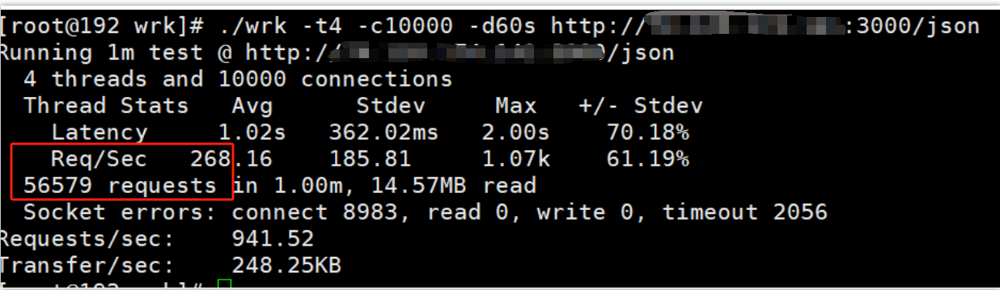

# Node.js Express vs Fastify Stress Test Comparison

This repository contains a stress test comparison between Node.js Express and Fastify frameworks.
We measure the performance using QPS (Queries Per Second) and compare the results.

## Directory Structure

- `express/`: Contains the Node.js Express application.
- `fastify/`: Contains the Node.js Fastify application.

## Stress Test Results

### QPS Comparison test environment

 �
### Test Result

�
 🚀

 �
## Conclusion

In our stress test comparison, Fastify demonstrated superior performance compared to Express. The QPS charts and test result clearly illustrate the efficiency of Fastify under stress conditions.

Feel free to explore the individual folders for detailed implementations and configurations.

## How to Run the Tests

1. Navigate to the `express/` or `fastify/` directory.
2. Install dependencies: `npm install`
3. Run the stress test: `node index.js`
4. Use Wrk to do the stress test `wrk -t4 -c10000 -d60s http://xxx`

## License

This project is licensed under the MIT License - see the [LICENSE](LICENSE) file for details.
